<!DOCTYPE html>
<html lang="en">
<body>

  <h1>Sweet Flower Shop - README</h1>
  <h2>Description 🌸</h2>
  

    Welcome to Sweet Flower Shop, an exquisite E-commerce app meticulously crafted with Kotlin to provide you
    with a delightful online shopping experience. Elevate your shopping journey with a suite of features,
    including login, registration, product management, shopping cart, user account customization,
    purchase history tracking, secure payment options, real-time notifications, chat functionality, and
    exclusive discount vouchers.
  

  <h2>Key Features 🔑</h2>
  <ul>
    <li>
      <strong>Login and Registration:</strong>
      <ul>
        <li>Users can seamlessly log in with existing accounts or create new ones.</li>
        <li>Robust account authentication to safeguard personal information.</li>
      </ul>
    </li>
    <li>
      <strong>Product Categories:</strong> Effortlessly browse through a variety of product categories for a delightful shopping experience.
    </li>
    <li>
      <strong>Product Details:</strong> Dive into detailed product information, enriched with vibrant images, descriptions, and prices.
    </li>
    <li>
      <strong>Shopping Cart:</strong>
      <ul>
        <li>Manage your shopping cart with ease—add, remove, and update product quantities effortlessly.</li>
        <li>Clearly displayed total order value for a transparent shopping experience.</li>
      </ul>
    </li>
    <li>
      <strong>User Account:</strong> Personalize your shopping journey by managing information, delivery addresses, and passwords.
    </li>
    <li>
      <strong>Purchase History:</strong> Keep track of your purchase history and review detailed expenses for each order.
    </li>
    <li>
      <strong>Payment:</strong> Enjoy a flexible and secure payment process with multiple payment methods.
    </li>
    <li>
      <strong>Notifications:</strong> Stay informed with real-time notifications on order status, promotions, and updates.
    </li>
    <li>
      <strong>Chat:</strong> Communicate directly with our support team or connect with other users through the in-app chat feature.
    </li>
    <li>
      <strong>Discount Vouchers:</strong> Apply exclusive discount vouchers during checkout to unlock special benefits.
    </li>
  </ul>

  <h2>Screenshots 🖼️</h2>

  
  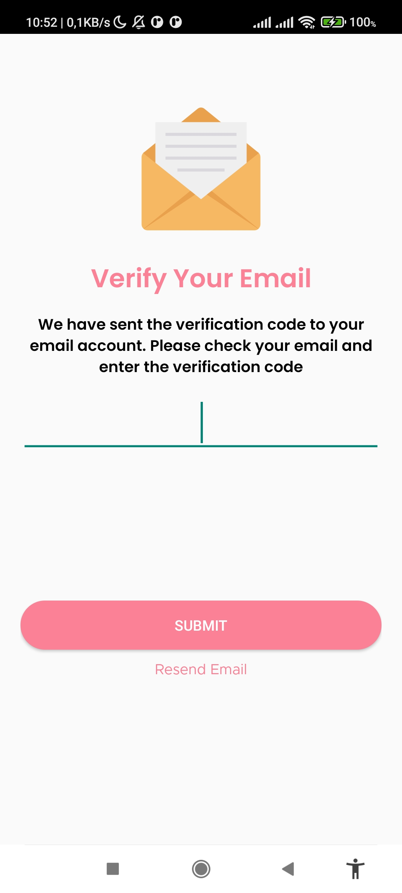
  
  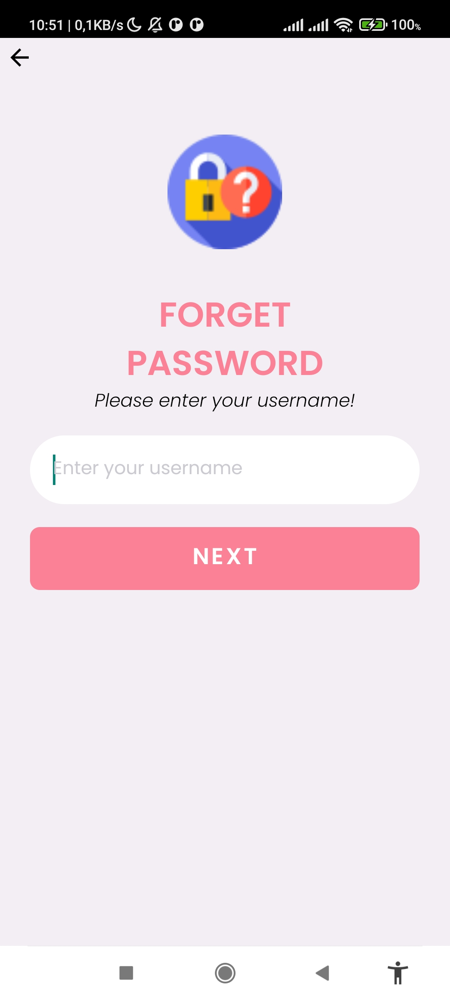
  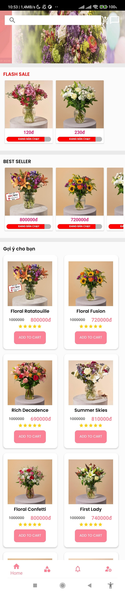
  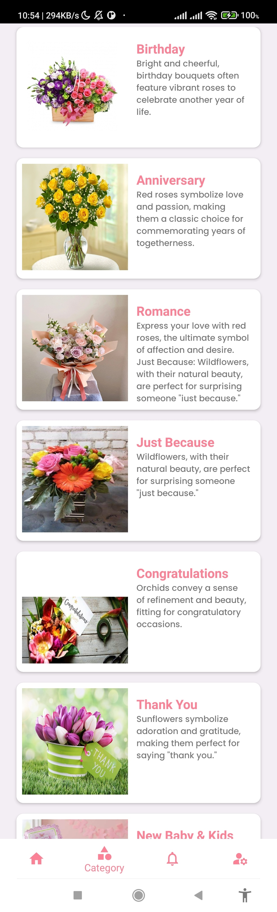
  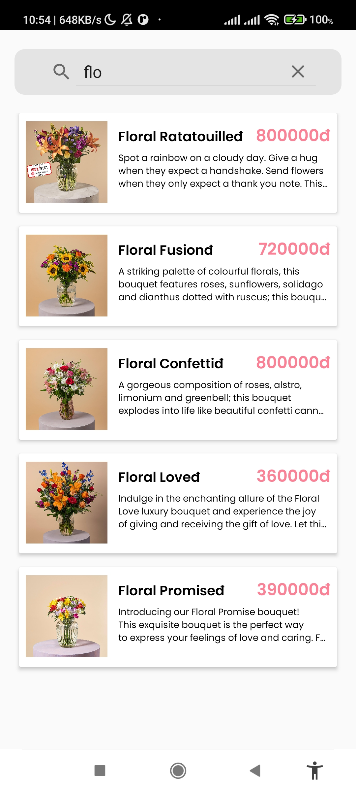
  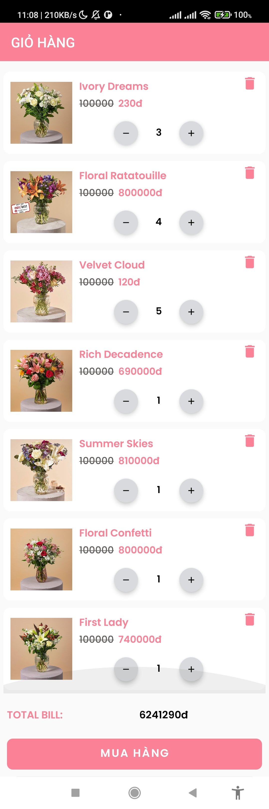
  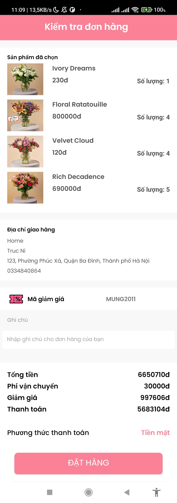
  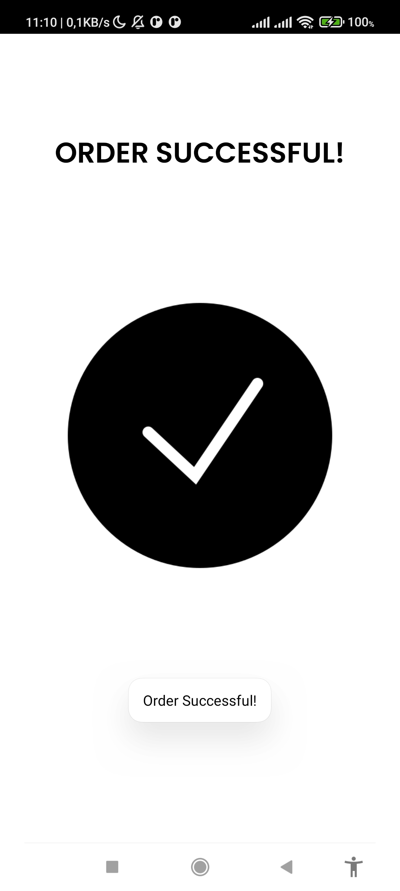
  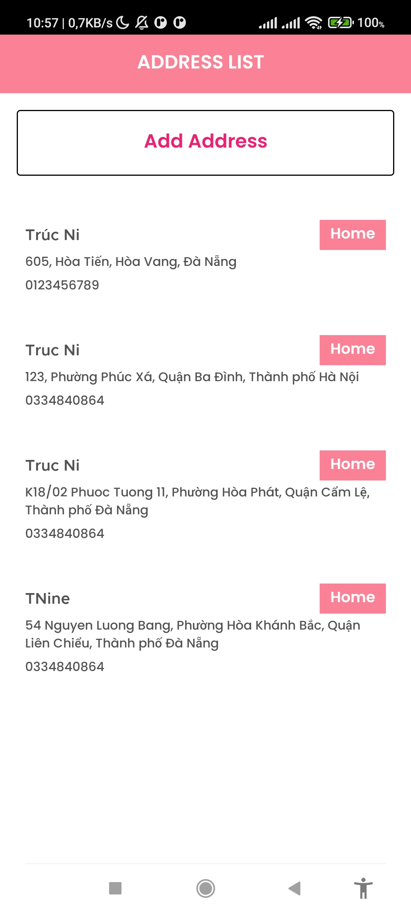
  
  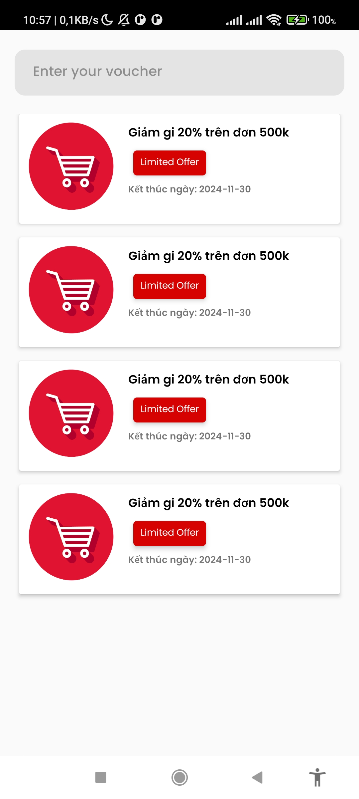
  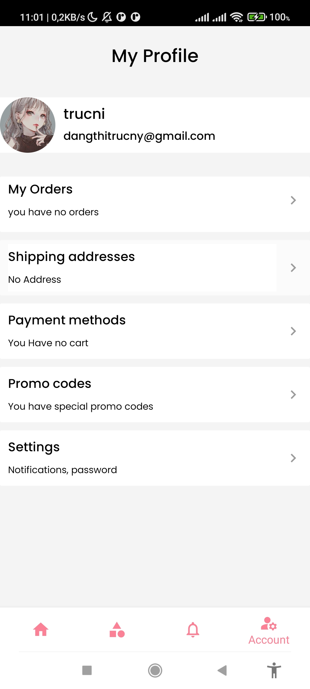
  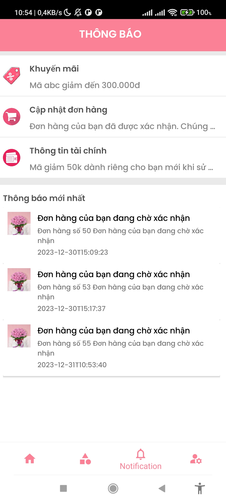
  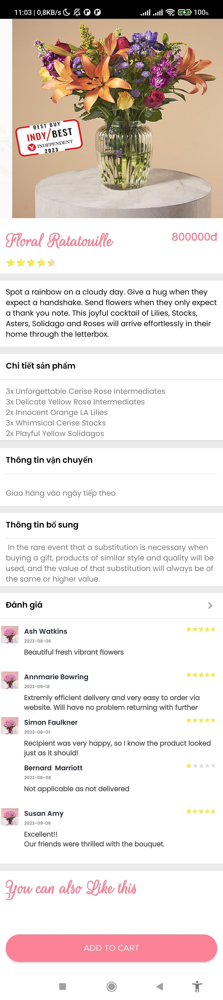
  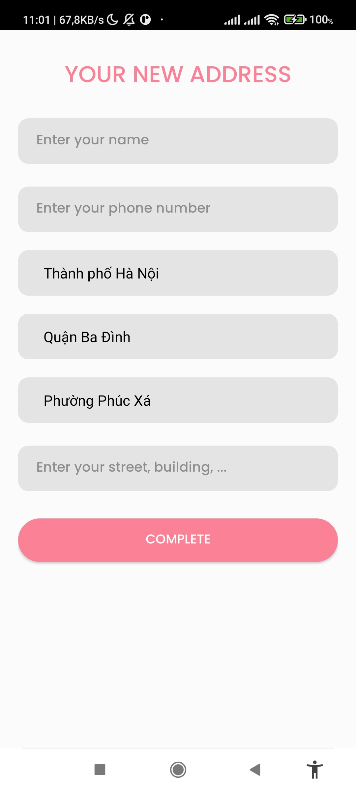
  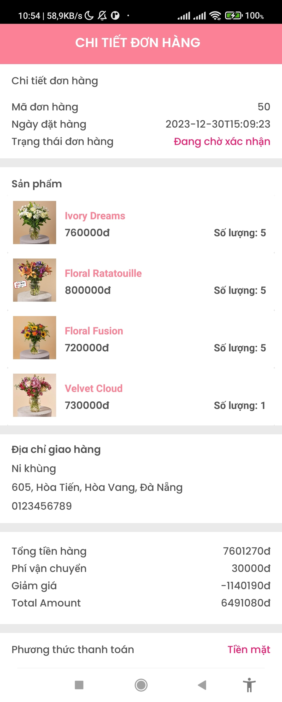
  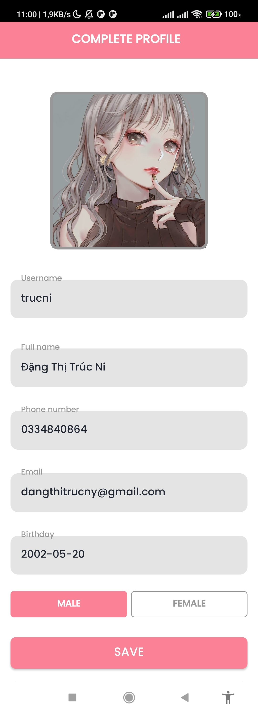
  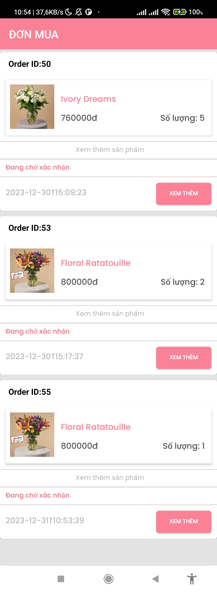
  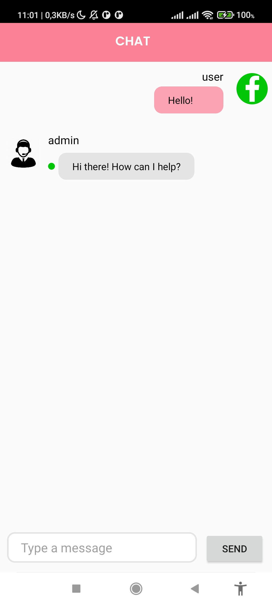

  <h2>Installation 🚀</h2>
  <ul>
    <li>
      <strong>System Requirements:</strong>
      <ul>
        <li>Android 5.0 and above.</li>
        <li>Ensure Kotlin Runtime is installed.</li>
      </ul>
    </li>
    <li>
      <strong>Clone Repository:</strong>
      <pre>git clone https://github.com/trucni2005/flower_shop.git</pre>
    </li>
    <li>
      <strong>Install Android Studio:</strong>
      <ul>
        <li>Open the project in Android Studio.</li>
        <li>Allow Android Studio to download and install dependencies.</li>
      </ul>
    </li>
    <li>
      <strong>Run the Application:</strong>
      <ul>
        <li>Connect your Android device or use an Emulator.</li>
        <li>Press the "Run" button in Android Studio.</li>
      </ul>
    </li>
  </ul>

  <h2>Contribution and Feedback 🤝</h2>
  
We welcome contributions from the community. Please feel free to open issues or create pull requests if you have any suggestions.

</body>

</html>
